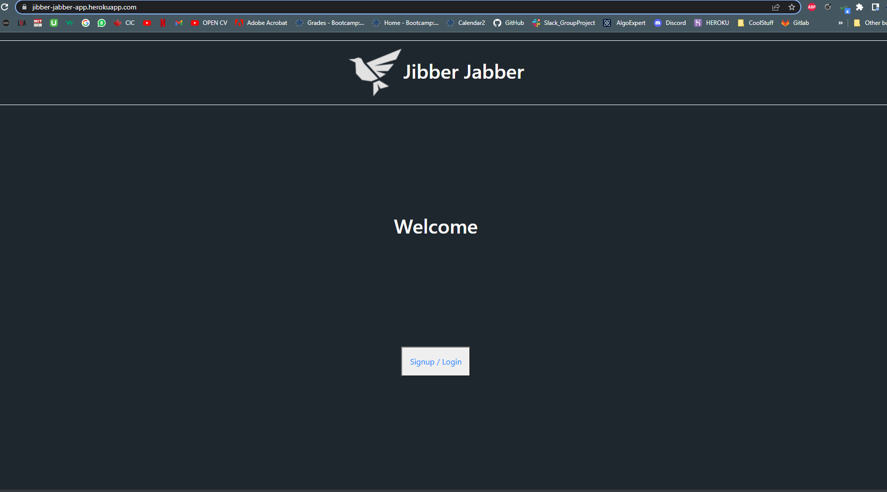
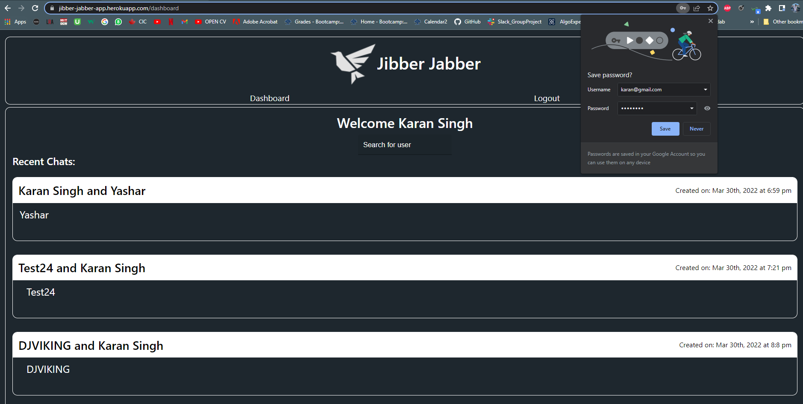

<h1 align='center'>Jibber-Jabber</h1>
    
    <h2 id="description">Description</h2>
    
This is a a typical messenger that helps you find people and shoot a text to them in real time. You are presented with a login/signup page. Once you signup or login with your account, you will be redirected to the dashboard page. This will contain all of our recent chats where you can click on any of the chats and then you get redirected to the personal chat room where you send and receive the messages. On the dashboard page, you can search a a user by their name and the results will be displayed from where you can click on the contact and send him a message. We have used GraphQl for interacting with the MongoDb, mongoose ODM, Express for server framwork, Socket IO for sending and receiving messages in real time.

Live Link: <a href="https://jibber-jabber-app.herokuapp.com/">https://jibber-jabber-app.herokuapp.com/</a>
    

    <h2>Table of Contents</h2>
    <ul>
        <li><a href="#description">Description</a></li>
        <li><a href="#install">Installation</a></li>
        <li><a href="#usage">Usage</a></li>
        <li><a href="#license">License</a></li>
        <li><a href="#contri">Contributing</a></li>
        <li><a href="#test">Tests</a></li>
        <li><a href="#question">Questions</a></li>
    </ul>
    

    <h2 id="install">Installation</h2>
    
graphql react apollo express

    

    <h2 id="usage">Usage</h2>
    
UofT bootcamp project

    

    <h2 id="license">License</h2>
    
    
MIT

    

    <h2 id="contri">Contributing</h2>
    
Karan Sodhi, Fabio Choi, Huzaifa Mohammed, Roberto Gasparin, Yashar Sarabi, Vincent Nguyen

    

    <h2 id="test">Tests</h2>
    
Unit

    

